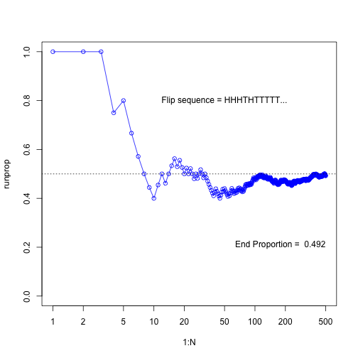
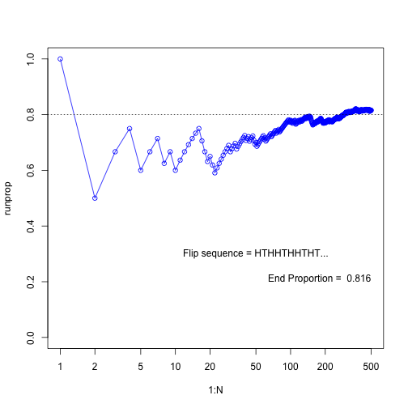
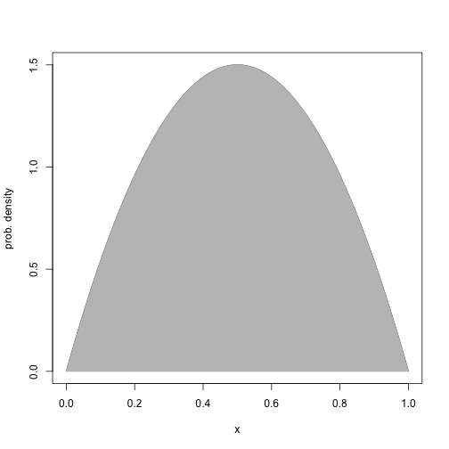
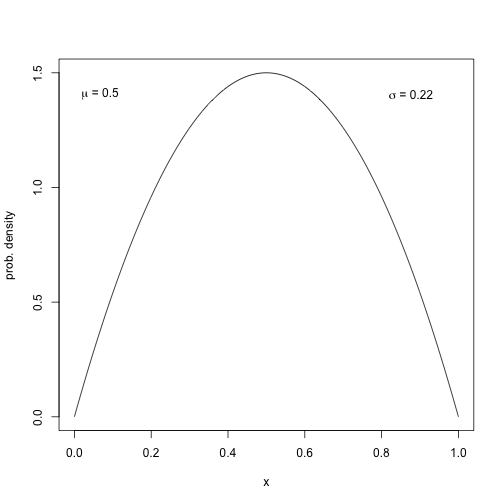
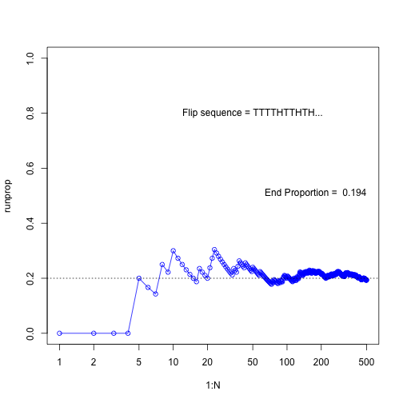
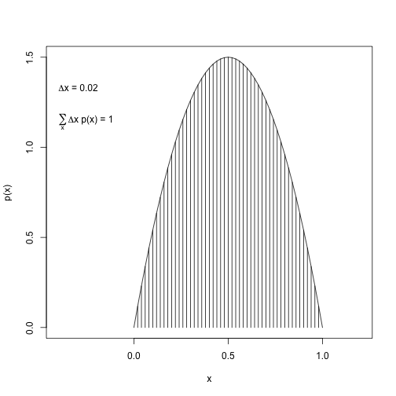
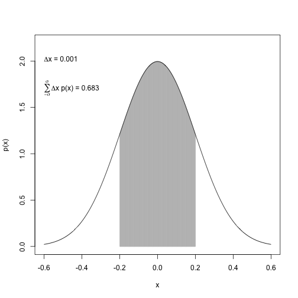

Kruschke - ch. 3
========================================================

# Running Proportions


```r
N <- 500
flipseq <- sample(x=c(0,1), size=N, replace=T)
r <- cumsum(flipseq)
runprop <- r/(1:N)
plot(1:N, runprop, type="o", log="x", ylim=c(0,1), col="blue")
abline(h=0.5, lty="dotted")
flipletters <- paste( c("T", "H")[flipseq[1:10] +1], collapse="")
displaystring <- paste("Flip sequence = ", flipletters, "...", sep="")
text(50, 0.8, labels=displaystring)
text(N, 0.2, # coordinates
     paste("End Proportion = ", runprop[N]), # text
     adj=c(1,0) # right aligned
     )
```



```r
dev.copy2pdf(file="/Users/Claudius/Dropbox/Kruschke_Dog_Book/RunningPropportion.pdf")
```

```
## quartz_off_screen 
##                 2
```

# HairEyeColor

### Looking at the data set


```r
show( HairEyeColor ) # built-in data set
```

```
## Error in eval(expr, envir, enclos): could not find function "show"
```

```r
dim( HairEyeColor ) # a 3-dimensional array
```

```
## [1] 4 4 2
```

```r
dimnames( HairEyeColor )
```

```
## $Hair
## [1] "Black" "Brown" "Red"   "Blond"
## 
## $Eye
## [1] "Brown" "Blue"  "Hazel" "Green"
## 
## $Sex
## [1] "Male"   "Female"
```

```r
class( HairEyeColor ) # an array of integer values
```

```
## [1] "table"
```

### Marginalise over sex and get joint probabilities


```r
# marginalise over the dimension "Sex"
EyeHairFreq = apply( X=HairEyeColor, MARGIN=c("Eye", "Hair"), FUN=sum ) 
EyeHairFreq
```

```
##        Hair
## Eye     Black Brown Red Blond
##   Brown    68   119  26     7
##   Blue     20    84  17    94
##   Hazel    15    54  14    10
##   Green     5    29  14    16
```

```r
class(EyeHairFreq) # 2-dimensional array, aka matrix
```

```
## [1] "matrix"
```

```r
sum(EyeHairFreq)
```

```
## [1] 592
```

```r
EyeHairProp = EyeHairFreq / sum(EyeHairFreq)
round(EyeHairProp, 2) # joint probabilities, as in table 4.1
```

```
##        Hair
## Eye     Black Brown  Red Blond
##   Brown  0.11  0.20 0.04  0.01
##   Blue   0.03  0.14 0.03  0.16
##   Hazel  0.03  0.09 0.02  0.02
##   Green  0.01  0.05 0.02  0.03
```

### Marginal probabilities of hair and eye color


```r
# get marginal probabilities of Hair color
HairFreq = apply(X=HairEyeColor, MARGIN=c("Hair"), FUN=sum) # the MARGIN argument specifies what dimension to keep
HairProp = HairFreq / sum(HairFreq)
round(HairProp, 2)
```

```
## Black Brown   Red Blond 
##  0.18  0.48  0.12  0.21
```

```r
# get marginal probabilities of Eye color
EyeFreq = apply(X=HairEyeColor, MARGIN=c("Eye"), FUN=sum)
EyeProp = EyeFreq / sum(EyeFreq)
round(EyeProp, 2)
```

```
## Brown  Blue Hazel Green 
##  0.37  0.36  0.16  0.11
```

### Conditional probability of hair color given blue eye color


```r
round(EyeHairProp, 2)
```

```
##        Hair
## Eye     Black Brown  Red Blond
##   Brown  0.11  0.20 0.04  0.01
##   Blue   0.03  0.14 0.03  0.16
##   Hazel  0.03  0.09 0.02  0.02
##   Green  0.01  0.05 0.02  0.03
```

```r
# joint probs of Blue Eye color and all Hair colors
round(EyeHairProp["Blue",], 2)
```

```
## Black Brown   Red Blond 
##  0.03  0.14  0.03  0.16
```

```r
# marginal prob. of blue eye color
EyeProp["Blue"]
```

```
##      Blue 
## 0.3631757
```

```r
# conditional prob. of hair colors given eye color is blue
round( EyeHairProp["Blue",] / EyeProp["Blue"], 2)
```

```
## Black Brown   Red Blond 
##  0.09  0.39  0.08  0.44
```

$$
p(Hair* | Eye = Blue) = \frac{p(Hair*, Eye = Blue)}{p(Eye = Blue)}
$$

Hair* stands for any of the 4 hair colors. The conditional probability of a hair color given blue eye color is the joint probability over the marginal probability of blue eye color, i. e. the proportion of people with blue eyes that also have that specific hair color. With blue eyes the person is clearly much more likely to have blond or brown hair than Black or red. There is clearly a correlation between these two traits, also called linkage disequilibrium.

### What is the probability of eye colors given brown hair?


```r
# joint frequencies of eye colors with brown hair
round(EyeHairProp[, "Brown"], 2)
```

```
## Brown  Blue Hazel Green 
##  0.20  0.14  0.09  0.05
```

```r
# marginal probability of brown hair
round(HairProp["Brown"], 2)
```

```
## Brown 
##  0.48
```

```r
# conditional probs of eye colors given brown hair
round(EyeHairProp[, "Brown"] / HairProp["Brown"], 2)
```

```
## Brown  Blue Hazel Green 
##  0.42  0.29  0.19  0.10
```

It looks like people with brown hair are much more likely to have brown eyes than green eyes.

# Simulate running proportions of flipping a biases coin


```r
N <- 500
pHead = 0.8
flipseq <- sample(x=c(0,1), prob=c(1-pHead, pHead), size=N, replace=T) # Head counts as 1, Tail counts as 0
r <- cumsum(flipseq)
runprop <- r/(1:N)
plot(1:N, runprop, type="o", log="x", ylim=c(0,1), col="blue")
abline(h=0.8, lty="dotted")
flipletters <- paste( c("T", "H")[flipseq[1:10] +1], collapse="")
displaystring <- paste("Flip sequence = ", flipletters, "...", sep="")
text(50, 0.3, labels=displaystring)
text(N, 0.2, # coordinates
     paste("End Proportion = ", runprop[N]), # text
     adj=c(1,0) # right aligned
     )
```



For the `sample` function in `R` one can give a vector of probabilities to the argument `prob` of the same length as the vector to sample from. Here, this allows to specify with which probability 0 or 1 are sampled.

# Integral of Density

### Normal density


```r
mean <- 0
sd <- 0.2
xlow <- mean - 3*sd
xhigh <- mean + 3*sd
dx <- 0.02
x <- seq(xlow, xhigh, by=dx)
y <- 1/(sd*sqrt(2*pi))*exp(-1/2*(x-mean)^2/sd^2)
plot(x, y, type="h", lwd=1, ylab="p(x)")
lines(x, y)
# approximate integral
( area <- sum(y*dx) )
```

```
## [1] 0.9977213
```

```r
# add text to plot
# using function bquote
text(-sd, .9*max(y), adj=c(1,0), 
     labels=bquote( paste(mu, " = ", .(mean)) )
     )
text(-sd, .8*max(y), adj=c(1,0),
     labels=bquote( paste(sigma, " = ", .(sd)) )
     )
text(sd, .9*max(y), adj=c(0,0),
     labels=bquote( paste(Delta, "x = ", .(dx)) )
     )
text(sd, .8*max(y), adj=c(0,0.5),
     labels=bquote( paste(sum(,x,), Delta, "x p(x) = ", .(round(area, 3))) )
     )
```


```r
#dev.copy2pdf(file="/Users/Claudius/Dropbox/Kruschke_Dog_Book/IntegralOfDensity.pdf")
```

### A new prob density function $6x(1-x)$ defined over the range [0, 1]

Plot probability density function.


```r
xlow = 0
xhigh = 1
dx = 1/1000
x = seq(from=0, to=1, by=dx)
y = 6*x*(1-x)
plot(x, y, type="l", xlab="x", ylab="prob. density")
lines(x, y, type="h", col="grey")
```



Approximate the integral of the function over the range [0, 1].


```r
approx_integral = sum( dx * y )
round(approx_integral, 2)
```

```
## [1] 1
```

Get the mean and standard deviation of the function.

The mean can be calculated as in equation 4.7. It can also be approximated by splitting the continuous distribution of `x` into many intervals (as done above) and then using the probability that x falls into an interval as a weight for each `x`. This is done in the following:


```r
# prob. density 'y' needs to be converted to a probability by multiplying it 
# with the interval width
mu = sum( y*dx * x ) # see equation 4.5
mu
```

```
## [1] 0.4999995
```

The same principal can be used to approximate the variance of this distribution:

$$
\begin{align}
var(x) &= \int_{0}^{1} dx \quad p(x) [x-\mu]^{2} \\[5pt]
var(x) &= \int_{0}^{1} dx \quad 6x(1-x)[x-0.5]^{2} \\[5pt]
&= 0.05
\end{align}
$$


```r
var_x = sum( y*dx * (x-mu)^2 )
var_x
```

```
## [1] 0.04999975
```

Now, let's annotate the graph of the probability density with the values of its mean and standard deviation:


```r
plot(x, y, type="l", xlab="x", ylab="prob. density")

label = bquote( paste( mu, " = ", .(round(mu, 1)) ) )
text(0, 1.4, label, pos=4)
label = bquote( paste( sigma, " = ", .(round(sqrt(var_x), 2)) ) )
text(0.8, 1.4, label, pos=4)
```



# Exercise 3.1


```r
N <- 500
flipseq <- sample(x=c(0,1), prob=c(0.8, 0.2), size=N, replace=T)
r <- cumsum(flipseq)
runprop <- r/(1:N)
plot(1:N, runprop, type="o", log="x", ylim=c(0,1), col="blue")
abline(a=0.2, b=0, lty=3)
flipletters <- paste( c("T", "H")[flipseq[1:10] +1], collapse="")
displaystring <- paste("Flip sequence = ", flipletters, "...", sep="")
text(50, 0.8, labels=displaystring)
text(N, 0.5, # coordinates
     paste("End Proportion = ", runprop[N]), # text
     adj=c(1,0) # right aligned
     )
```



# Exercise 3.3

## (A)


```r
dx <- 0.02
x <- seq(from=0, to=1, by=dx)
y <- 6*x*(1-x)
plot(x, y, type="h", ylab="p(x)", xlim=c(-.4, 1.2))
lines(x,y)
( area <- sum(dx * y) )
```

```
## [1] 0.9996
```

```r
# add text to plot
text(-.4, .9*max(y), adj=c(0,1),
     labels=bquote(paste(Delta, "x = ", .(dx)))
     )
text(-.4, .8*max(y), adj=c(0,1),
     labels=bquote( paste(sum(,x,), Delta, "x p(x) = ", .(round(area,3))) )
       )
```



## (B)

$$
\begin{align}
& \int_{0}^{1} 6x(1-x) dx \\[5pt]
&= 6 \int_{0}^{1} x(1-x) dx \\[5pt]
&= 6 \int_{0}^{1} x-x^2 dx \\[5pt]
&= 6\left[\frac{1}{2}x^{2} - \frac{1}{3}x^{3}\right]_{0}^{1} \\[5pt]
&= 6\left[\frac{1}{2} - \frac{1}{3} \right] \\[5pt]
&= \frac{6}{2} - \frac{6}{3} \\[5pt]
&= 3 - 2 \\[5pt]
&= 1
\end{align}
$$

# Exercise 4.5

## (A) Probability under normal curve between $\mu-\sigma$ and $\mu+\sigma$


```r
mean <- 0
sd <- 0.2
xlow <- mean - 3*sd
xhigh <- mean + 3*sd
dx <- 1/1000
x <- seq(from=xlow, to=xhigh, by=dx)
y <- 1/(sd*sqrt(2*pi))*exp(-1/2*(x-mean)^2/sd^2)
index <- (x >= -sd) & (x <= sd)
plot(x[index], y[index], 
     type="h", col="grey",
     ylab="p(x)",
     xlab="x",
     xlim=c(mean-3*sd, mean+3*sd),
     ylim=c(0, 1.1*max(y))
     )
lines(x,y)
# approx. area by grid
( area <- sum(y[index] * dx) )
```

```
## [1] 0.6826885
```

```r
# exact area
( pnorm(sd, mean=0, sd=sd) - pnorm(-sd, mean=0, sd=sd) )
```

```
## [1] 0.6826895
```

```r
# add text to plot
text(-.6, 2, adj=c(0,0),
     labels=bquote(paste(Delta, "x = ", .(dx)))
     )
text(-.6, 1.8, adj=c(0,1),
     labels=bquote(
             paste(
                     sum(, x=-sigma, x=sigma), 
                     Delta, "x p(x) = ", 
                     .(round(area,3))
                     )
             )
)
```



In a normal distribution, about 68% of the probability mass lies within one standard deviation around the mean.

## (B)


```r
mean <- 162
sd <- 177 - 162
curve(dnorm(x, mean, sd), from=162-3*sd, to=162+3*sd, ylab="p(x)")
abline(v=c(147, 177), lty=3)
```


# Exercise 4.6

### Food preferences among school children of different ages


```r
# get the conditional probs into a matrix
cond.prob <- matrix(c(0.3,.6,.3,.6,.3,.1,.1,.1,.6), 
              nrow=3, ncol=3, 
               dimnames=list(c("1st graders", "2nd graders", "3rd graders"), c("Ice Cream", "Fruit", "French Fries")))
cond.prob
```

```
##             Ice Cream Fruit French Fries
## 1st graders       0.3   0.6          0.1
## 2nd graders       0.6   0.3          0.1
## 3rd graders       0.3   0.1          0.6
```

```r
# get grade probs
grade.prob <- c(.2, .2, .6)
# multiply conditional prob by grade prob
# to get the conjoint prob of grade and food
( conjoint.prob <- cond.prob * grade.prob )
```

```
##             Ice Cream Fruit French Fries
## 1st graders      0.06  0.12         0.02
## 2nd graders      0.12  0.06         0.02
## 3rd graders      0.18  0.06         0.36
```

If grade and food were independent, then the conjoint
probabilities would be the same as the product of the 
two marginal probabilities for food and grade.


```r
# marginal probabilities of the food
( marg.food <- colSums(conjoint.prob) )
```

```
##    Ice Cream        Fruit French Fries 
##         0.36         0.24         0.40
```

```r
# marginal probabilities of the grade
# must be the same as grade.prob
( marg.grade <- rowSums(conjoint.prob) )
```

```
## 1st graders 2nd graders 3rd graders 
##         0.2         0.2         0.6
```

```r
conjoint.prob
```

```
##             Ice Cream Fruit French Fries
## 1st graders      0.06  0.12         0.02
## 2nd graders      0.12  0.06         0.02
## 3rd graders      0.18  0.06         0.36
```

```r
# get cross product of marginal probabilities
( indep.joint.prob <- outer(marg.grade, marg.food) )
```

```
##             Ice Cream Fruit French Fries
## 1st graders     0.072 0.048         0.08
## 2nd graders     0.072 0.048         0.08
## 3rd graders     0.216 0.144         0.24
```

```r
#class(marg.grade)
#class(t(as.vector(marg.food)))
#( indep.joint.prob <- as.vector(marg.grade) %*% t(as.vector(marg.food)) )
# get the difference between the joint probs. assuming independence of
# grade and food preference and the observed joint probs
( indep.joint.prob - conjoint.prob )
```

```
##             Ice Cream  Fruit French Fries
## 1st graders     0.012 -0.072         0.06
## 2nd graders    -0.048 -0.012         0.06
## 3rd graders     0.036  0.084        -0.12
```
The table of conjoint probabilities cannot be reconstructed by multiplying grade and food probabilities, hence food and grade are not independent.

