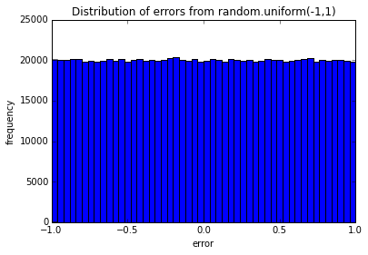

~~~ {.python}
0.15 * 9.81 / 0.1015
~~~

    14.497536945812808

~~~ {.python}
import pylab, random
~~~

~~~ {.python}
def getData(filename):
    distances = []
    masses = []
    with open(filename, 'r') as dataFile:
        dataFile.readline() # discard header line
        for line in dataFile:
            dist, mass = line.split()
            distances.append( float(dist) )
            masses.append( float(mass) )
    return masses, distances
~~~

~~~ {.python}
def plotData(filename):
    xVals, yVals = getData(filename)
    xVals = pylab.array(xVals) # vectorise
    yVals = pylab.array(yVals) # vectorise
    xVals = xVals * 9.81 # convert mass to Newtons by multiplying with gravitational constant
    pylab.plot(xVals, yVals, 'bo', label='Measured displacements')
    pylab.title('Measured Displacement of Spring')
    pylab.xlabel('Force (Newtons)')
    pylab.ylabel('Distance (meters)')
~~~

~~~ {.python}
filename = '../springData.txt'
~~~

~~~ {.python}
plotData(filename)
pylab.show()
~~~

~~~ {.python}
def testErrors(nTrials=100, sample_size=100, error_dist='random.triangular(-1,1)'):
    """
    Simulates the sum of random effects.
    
    Samples 'sample_size' random effects from the 'error_dist' and sums them up.
    Repeats this 'nTrials' times and plots the distribution of sampled errors and
    the distribution of the sum of sampled errors from each trial.
    """
    sumsOfErrors = [0] * nTrials
    Errors = [0] * nTrials * sample_size
    for t in xrange(nTrials):
        for s in xrange(sample_size):
            error = eval(error_dist)
            sumsOfErrors[t] += error
            Errors[t*sample_size + s] = error
    pylab.figure()
    pylab.hist(Errors, bins=50)
    pylab.title('Distribution of errors from ' + error_dist)
    pylab.xlabel('error')
    pylab.ylabel('frequency')
    pylab.figure()
    pylab.hist(sumsOfErrors, bins=50)
    pylab.title('Sum of 100 random points from ' + error_dist + ' (' + str(nTrials) + ' Trials)')
    pylab.xlabel('Sum')
    pylab.ylabel('Number of trials')
~~~

~~~ {.python}
l = [0] * 10 * 10
print l
for i in range(10):
    for j in range(10):
        l[i*10+j] = 1
print l
~~~

    [0, 0, 0, 0, 0, 0, 0, 0, 0, 0, 0, 0, 0, 0, 0, 0, 0, 0, 0, 0, 0, 0, 0, 0, 0, 0, 0, 0, 0, 0, 0, 0, 0, 0, 0, 0, 0, 0, 0, 0, 0, 0, 0, 0, 0, 0, 0, 0, 0, 0, 0, 0, 0, 0, 0, 0, 0, 0, 0, 0, 0, 0, 0, 0, 0, 0, 0, 0, 0, 0, 0, 0, 0, 0, 0, 0, 0, 0, 0, 0, 0, 0, 0, 0, 0, 0, 0, 0, 0, 0, 0, 0, 0, 0, 0, 0, 0, 0, 0, 0]
    [1, 1, 1, 1, 1, 1, 1, 1, 1, 1, 1, 1, 1, 1, 1, 1, 1, 1, 1, 1, 1, 1, 1, 1, 1, 1, 1, 1, 1, 1, 1, 1, 1, 1, 1, 1, 1, 1, 1, 1, 1, 1, 1, 1, 1, 1, 1, 1, 1, 1, 1, 1, 1, 1, 1, 1, 1, 1, 1, 1, 1, 1, 1, 1, 1, 1, 1, 1, 1, 1, 1, 1, 1, 1, 1, 1, 1, 1, 1, 1, 1, 1, 1, 1, 1, 1, 1, 1, 1, 1, 1, 1, 1, 1, 1, 1, 1, 1, 1, 1]

~~~ {.python}
%matplotlib inline
~~~

~~~ {.python}
testErrors(nTrials=10000)
pylab.show()
~~~

~~~ {.python}
testErrors(nTrials=10000, error_dist='random.uniform(-1,1)')
pylab.show()
~~~

~~~ {.python}
testErrors(nTrials=10000, error_dist='random.gammavariate(alpha=3,beta=30)')
pylab.show()
~~~

~~~ {.python}
testErrors(nTrials=10000, error_dist='random.lognormvariate(mu=0, sigma=1)')
pylab.show()
~~~

The sum of random errors, no matter what their distribution, seems to converge to a normal distribution.

~~~ {.python}
a = [0] * 1000
b = [0] * 1000
for i in range(1000):
    a[i] = random.gauss(mu=0, sigma=3)
    b[i] = random.gauss(mu=0, sigma=5)
pylab.figure()
pylab.hist(a, bins=10)
pylab.figure()
pylab.hist(b, bins=10)
pylab.show()
~~~

~~~ {.python}
216/8.0
~~~

    27.0

~~~ {.python}
import random, pylab
~~~

~~~ {.python}
def testHashFunc(N):
    l = []
    for _ in range(N):
        l.extend([random.randint(0,99) % 10 for _ in range(100)])
    pylab.hist(l, bins=10)
    pylab.title('N = ' + str(N))
    pylab.show()
~~~

~~~ {.python}
testHashFunc(10)
testHashFunc(100)
testHashFunc(1000)
~~~

~~~ {.python}
xVals = []
yVals = []
wVals = []
for i in range(1000):
    xVals.append(random.random())
    yVals.append(random.random())
    wVals.append(random.random())
xVals = pylab.array(xVals)
yVals = pylab.array(yVals)
wVals = pylab.array(wVals)
xVals = xVals + xVals
zVals = xVals + yVals
tVals = xVals + yVals + wVals
~~~

~~~ {.python}
pylab.hist(tVals, bins=15)
pylab.show()
~~~

The sum of random numbers is normally distributed!

~~~ {.python}
pylab.hist(xVals, bins=15)
pylab.show()
~~~

~~~ {.python}
pylab.plot(xVals, zVals)
pylab.show()
~~~

Although the `zVals` are normally distributed they are positively correlated with the `xVals`.

~~~ {.python}
pylab.plot(xVals, yVals)
pylab.show()
~~~

Both `xVals` and `yVals` are uniformly distributed.

~~~ {.python}
pylab.plot(xVals, sorted(yVals))
pylab.show()
~~~

### Fix the backend of matplotlib to allow figures to show up

~~~ {.python}
import matplotlib
print matplotlib.matplotlib_fname()
~~~

    /Users/Claudius/anaconda/lib/python2.7/site-packages/matplotlib/mpl-data/matplotlibrc

backend : qt2agg

### Fiiting a Curve to data

~~~ {.python}
def fitData(fileName):
    """
    Uses pylab's 'polyfit' function to fit a straight line to the data,
    i. e. to do a linear regression
    """
    xVals, yVals = getData(fileName)
    xVals = pylab.array(xVals)
    yVals = pylab.array(yVals)
    xVals = xVals*9.81  # convert mass to force (F = mg)
    pylab.plot(xVals, yVals, 'bo', label = 'Measured points')
    pylab.title('Measured Displacement of Spring')
    pylab.xlabel('Force (Newtons)')
    pylab.ylabel('Distance (meters)')
    a,b = pylab.polyfit(xVals, yVals, 1)  # fit y = ax + b
    # use line equation to graph predicted values
    estYVals = a*xVals + b
    k = 1/a
    pylab.plot(xVals, estYVals, label = 'Linear fit, k = '
               + str(round(k, 5)))
    pylab.legend(loc = 'best')
~~~

~~~ {.python}
fileName = '../springData.txt'
fitData(filename)
pylab.show()
~~~

~~~ {.python}
def fitData1(fileName):
    """
    Does linear and cubic regression of data and plots those curves with the data
    """
    xVals, yVals = getData(fileName)
    xVals = pylab.array(xVals)
    yVals = pylab.array(yVals)
    xVals = xVals*9.81  # convert mass to force (F = mg)
    pylab.plot(xVals, yVals, 'bo', label = 'Measured displacements')
    pylab.title('Measured Displacement of Spring')
    pylab.xlabel('|Force| (Newtons)')
    pylab.ylabel('Distance (meters)')
    # linear regression
    a,b = pylab.polyfit(xVals, yVals, 1) 
    estYVals = a*xVals + b
    pylab.plot(xVals, estYVals, label = 'Linear fit')
    # cubic regresson
    a,b,c,d = pylab.polyfit(xVals, yVals, 3)
    estYVals = a*(xVals**3) + b*xVals**2 + c*xVals + d
    pylab.plot(xVals, estYVals, label = 'Cubic fit')
    pylab.legend(loc = 'best')
~~~

~~~ {.python}
fileName = '../springData.txt'
fitData1(filename)
pylab.show()
~~~

~~~ {.python}
def fitData2(fileName):
    """
    """
    xVals, yVals = getData(fileName)
    # add some potential heavier masses that haven't been tried yet:
    extX = pylab.array(xVals + [1.05, 1.1, 1.15, 1.2, 1.25]) 
    xVals = pylab.array(xVals)
    yVals = pylab.array(yVals)
    xVals = xVals*9.81  # convert mass to force (F = mg)
    extX = extX*9.81    # convert mass to force (F = mg)
    pylab.plot(xVals, yVals, 'bo', label = 'Measured displacements')
    pylab.title('Measured Displacement of Spring')
    pylab.xlabel('|Force| (Newtons)')
    pylab.ylabel('Distance (meters)')
    # linear regression:
    a,b = pylab.polyfit(xVals, yVals, 1)
    estYVals = a*extX + b
    pylab.plot(extX, estYVals, label = 'Linear fit')
    # cubic regression
    a,b,c,d = pylab.polyfit(xVals, yVals, 3)
    estYVals = a*(extX**3) + b*extX**2 + c*extX + d
    pylab.plot(extX, estYVals, label = 'Cubic fit')
    pylab.legend(loc = 'best')
~~~

~~~ {.python}
fileName = '../springData.txt'
fitData2(filename)
pylab.show()
~~~

The prediction from the cubic model does not make sense.

~~~ {.python}
def fitData3(fileName):
    xVals, yVals = getData(fileName)
    # remove last 6 values from data, for which Hooks law might not apply:
    xVals = pylab.array(xVals[:-6])
    yVals = pylab.array(yVals[:-6])
    xVals = xVals*9.81  # convert mass to force (F = mg)
    pylab.plot(xVals, yVals, 'bo', label = 'Measured points')
    pylab.title('Measured Displacement of Spring')
    pylab.xlabel('Force (Newtons)')
    pylab.ylabel('Distance (meters)')
    a,b = pylab.polyfit(xVals, yVals, 1)  # fix y = ax + b
    # use line equation to graph predicted values
    estYVals = a*xVals + b
    k = 1/a
    pylab.plot(xVals, estYVals, label = 'Linear fit, k = '
               + str(round(k, 5)))
    pylab.legend(loc = 'best')
~~~

~~~ {.python}
fileName = '../springData.txt'
fitData3(filename)
pylab.show()
~~~

### Goodness of Fit of a model to data

Heigth of flying arrow measured in 4 replicates and over a range of distances.

~~~ {.python}
def getTrajectoryData(fileName):
    """
    reads the data in the launcherData.txt file
    """
    dataFile = open(fileName, 'r')
    distances = []
    heights1, heights2, heights3, heights4 = [],[],[],[]
    discardHeader = dataFile.readline()
    for line in dataFile:
        d, h1, h2, h3, h4 = line.split()
        distances.append(float(d))
        heights1.append(float(h1))
        heights2.append(float(h2))
        heights3.append(float(h3))
        heights4.append(float(h4))
    dataFile.close()
    return (distances, [heights1, heights2, heights3, heights4])
~~~

~~~ {.python}
def tryFits(fName):
    """
    plots the mean of the height measurements over the distances as well as
    a linear and quadratic fit
    """
    distances, heights = getTrajectoryData(fName)
    distances = pylab.array(distances)*36 # conversion from yeards to inches
    # get average of height measurements for each distance
    totHeights = pylab.array([0]*len(distances))
    for h in heights: # 'heights' is an array of arrays
        totHeights = totHeights + pylab.array(h) # vectorised addition
    meanHeights = totHeights/float(len(heights))
    # plot the data
    pylab.title('Trajectory of Projectile (Mean of 4 Trials)')
    pylab.xlabel('Inches from Launch Point')
    pylab.ylabel('Inches Above Launch Point')
    pylab.plot(distances, meanHeights, 'bo')
    # linear regression
    a,b = pylab.polyfit(distances, meanHeights, 1)
    altitudes = a*distances + b
    pylab.plot(distances, altitudes, 'r',
               label = 'Linear Fit')
    # quadratic polynomial regression (second degree)
    a,b,c = pylab.polyfit(distances, meanHeights, 2)
    altitudes = a*(distances**2) + b*distances + c
    pylab.plot(distances, altitudes, 'g',
               label = 'Quadratic Fit')
    pylab.legend()
~~~

~~~ {.python}
?pylab.polyfit
~~~

~~~ {.python}
%matplotlib inline

tryFits('../launcherData.txt')
pylab.show()
~~~

$R^{2}$ is a measure of the goodness of fit of a model to data and can be interpreted as the proportion of variance explained by the model:

$$
R^{2} = 1 - \frac{\sigma_{residual}^{2}}{\sigma_{total}^{2}}
$$

The variance of residuals $\sigma_{residual}^{2}$ is the variance unexplained by the model.

~~~ {.python}
def rSquare(measured, estimated):
    """
    measured: one dimensional array of measured values
    estimate: one dimensional array of predicted values
    
    returns the coefficient of determination R squared
    """
    SS_res = ((estimated - measured)**2).sum() # sum of squares of residuals
    data_mean = measured.sum()/float(len(measured)) # mean of all data values
    SS_tot = ((data_mean - measured)**2).sum() # total sum of squares
    return 1 - SS_res/SS_tot
~~~

~~~ {.python}
def tryFits1(fName):
    distances, heights = getTrajectoryData(fName)
    distances = pylab.array(distances)*36
    totHeights = pylab.array([0]*len(distances))
    # get average of height measurements for each distance
    for h in heights:
        totHeights = totHeights + pylab.array(h)
    meanHeights = totHeights/float(len(heights))
    # plot data
    pylab.title('Trajectory of Projectile (Mean of 4 Trials)')
    pylab.xlabel('Inches from Launch Point')
    pylab.ylabel('Inches Above Launch Point')
    pylab.plot(distances, meanHeights, 'bo')
    # linear regression
    a,b = pylab.polyfit(distances, meanHeights, 1)
    altitudes = a*distances + b
    pylab.plot(distances, altitudes, 'r',
               label = 'Linear Fit' + ', R2 = '
               + str(round(rSquare(meanHeights, altitudes), 4))) # include R^2 in legend
    # quadratic regression
    a,b,c = pylab.polyfit(distances, meanHeights, 2)
    altitudes = a*(distances**2) + b*distances + c
    pylab.plot(distances, altitudes, 'g',
               label = 'Quadratic Fit' + ', R2 = '
               + str(round(rSquare(meanHeights, altitudes), 4))) # include R^2 in legend
    pylab.legend(loc="lower center")
~~~

~~~ {.python}
tryFits1('../launcherData.txt')
pylab.show()
~~~

~~~ {.python}
?pylab.legend()
~~~

~~~ {.python}
def fitDataWithRsquare(fileName):
    """
    Uses pylab's 'polyfit' function to fit a straight line to the data,
    i. e. to do a linear regression
    """
    # get data from file
    xVals, yVals = getData(fileName)
    xVals = pylab.array(xVals)
    yVals = pylab.array(yVals)
    xVals = xVals*9.81  # convert mass to force (F = mg)
    # plot the data
    pylab.plot(xVals, yVals, 'bo', label = 'Measured points')
    pylab.title('Measured Displacement of Spring')
    pylab.xlabel('Force (Newtons)')
    pylab.ylabel('Distance (meters)')
    # first degree linear regression
    a,b = pylab.polyfit(xVals, yVals, 1)  # fit y = ax + b
    # use line equation to graph predicted values
    estYVals = a*xVals + b
    pylab.plot(xVals, estYVals, label = 'Linear fit, R = '
               + str(round(rSquare(yVals, estYVals), 5)))
    pylab.legend(loc = 'best')
~~~

~~~ {.python}
fitDataWithRsquare('../springData.txt')
pylab.show()
~~~

~~~ {.python}
def fitData3WithRsquare(fileName):
    """
    Uses pylab's 'polyfit' function to fit a straight line to the data,
    i. e. to do a linear regression
    """
    # get data from file
    xVals, yVals = getData(fileName)
    # remove last six data points where Hooke's law might not apply:
    xVals = pylab.array(xVals[:-6]) # skip last 6 values
    yVals = pylab.array(yVals[:-6])
    xVals = xVals*9.81  # convert mass to force (F = mg)
    # plot the data
    pylab.plot(xVals, yVals, 'bo', label = 'Measured points')
    pylab.title('Measured Displacement of Spring')
    pylab.xlabel('Force (Newtons)')
    pylab.ylabel('Distance (meters)')
    # first degree linear regression
    a,b = pylab.polyfit(xVals, yVals, 1)  # fit y = ax + b
    # use line equation to graph predicted values
    estYVals = a*xVals + b
    pylab.plot(xVals, estYVals, label = 'Linear fit, R^2 = '
               + str(round(rSquare(yVals, estYVals), 4)))
    pylab.legend(loc = 'best')
~~~

~~~ {.python}
fitData3WithRsquare('../springData.txt')
pylab.show()
~~~

## The Effect of Delaying Treatment on Patient Disease

This problem set makes use of classes that I have defined for the problem set of last week: simulating virus population in patient and effect of drugs.

Instead of copying all the code into this notebook, I have converted the `Monte-Carlosimulations.ipynb` to pure python with `jupyter nbconvert --to python Monte-Carlosimulations.ipynb`. I am going to import this script as a module.

The directories where python looks for modules are:

~~~ {.python}
import sys

print sys.path
~~~

    ['', '/Users/Claudius/anaconda/lib/python27.zip', '/Users/Claudius/anaconda/lib/python2.7', '/Users/Claudius/anaconda/lib/python2.7/plat-darwin', '/Users/Claudius/anaconda/lib/python2.7/plat-mac', '/Users/Claudius/anaconda/lib/python2.7/plat-mac/lib-scriptpackages', '/Users/Claudius/anaconda/lib/python2.7/lib-tk', '/Users/Claudius/anaconda/lib/python2.7/lib-old', '/Users/Claudius/anaconda/lib/python2.7/lib-dynload', '/Users/Claudius/anaconda/lib/python2.7/site-packages/Sphinx-1.3.1-py2.7.egg', '/Users/Claudius/anaconda/lib/python2.7/site-packages/setuptools-18.5-py2.7.egg', '/Users/Claudius/anaconda/lib/python2.7/site-packages', '/Users/Claudius/anaconda/lib/python2.7/site-packages/aeosa', '/Users/Claudius/anaconda/lib/python2.7/site-packages/IPython/extensions', '/Users/Claudius/.ipython']

I can modify the python path to make it look for modules in custom places first:

~~~ {.python}
sys.path = ['/Users/Claudius/Dropbox/MITx_6.00.2x_Introduction_to_Computational_Thinking_and_Data_Science'] + sys.path

print sys.path
~~~

    ['/Users/Claudius/Dropbox/MITx_6.00.2x_Introduction_to_Computational_Thinking_and_Data_Science', '', '/Users/Claudius/anaconda/lib/python27.zip', '/Users/Claudius/anaconda/lib/python2.7', '/Users/Claudius/anaconda/lib/python2.7/plat-darwin', '/Users/Claudius/anaconda/lib/python2.7/plat-mac', '/Users/Claudius/anaconda/lib/python2.7/plat-mac/lib-scriptpackages', '/Users/Claudius/anaconda/lib/python2.7/lib-tk', '/Users/Claudius/anaconda/lib/python2.7/lib-old', '/Users/Claudius/anaconda/lib/python2.7/lib-dynload', '/Users/Claudius/anaconda/lib/python2.7/site-packages/Sphinx-1.3.1-py2.7.egg', '/Users/Claudius/anaconda/lib/python2.7/site-packages/setuptools-18.5-py2.7.egg', '/Users/Claudius/anaconda/lib/python2.7/site-packages', '/Users/Claudius/anaconda/lib/python2.7/site-packages/aeosa', '/Users/Claudius/anaconda/lib/python2.7/site-packages/IPython/extensions', '/Users/Claudius/.ipython']

~~~ {.python}
import Monte_Carlo_simulations as VIRUS
~~~

~~~ {.python}
dir(VIRUS)
~~~

    ['NoChildException',
     'Patient',
     'ResistantVirus',
     'SimpleVirus',
     'TreatedPatient',
     '__builtins__',
     '__doc__',
     '__file__',
     '__name__',
     '__package__',
     'mark_recap',
     'numpy',
     'pylab',
     'random',
     'sim_mark_recap',
     'simulationWithDrug',
     'simulationWithoutDrug']

~~~ {.python}
v = VIRUS.SimpleVirus(maxBirthProb=0.5, clearProb=0.01)
~~~

~~~ {.python}
import inspect

print inspect.getsource(VIRUS.simulationWithDrug)
~~~

    def simulationWithDrug(numViruses, maxPop, maxBirthProb, clearProb, resistances,
                           mutProb, numTrials):
        """ 
        Runs simulations and plots graphs for problem 5.
    
        For each of numTrials trials, instantiates a patient, runs a simulation for
        150 timesteps, adds guttagonol, and runs the simulation for an additional
        150 timesteps.  At the end plots the average virus population size
        (for both the total virus population and the guttagonol-resistant virus
        population) as a function of time.
    
        numViruses: number of ResistantVirus to create for patient (an integer)
        maxPop: maximum virus population for patient (an integer)
        maxBirthProb: Maximum reproduction probability (a float between 0-1)        
        clearProb: maximum clearance probability (a float between 0-1)
        resistances: a dictionary of drugs that each ResistantVirus is resistant to
                     (e.g., {'guttagonol': False})
        mutProb: mutation probability for each ResistantVirus particle
                 (a float between 0-1). 
        numTrials: number of simulation runs to execute (an integer)
        
        """
        timesteps = 300
        virusTotalPop = [0] * timesteps
        virusResistPop = [0] * timesteps
        
        
        for _ in range(numTrials):
            # it is important to initialise the patient for each trial with a new list of
            # virus instances
            viruses = []
            for _ in range(numViruses):
                viruses.append( ResistantVirus(maxBirthProb, clearProb, resistances, mutProb) )
            #for v in viruses:
            #    print v.getResistances()
            p = TreatedPatient(viruses, maxPop)
            for i in range(timesteps/2):
                virusTotalPop[i] += p.update()
                virusResistPop[i] += p.getResistPop( resistances.keys() )
            p.addPrescription('guttagonol')
            for i in range(timesteps/2, timesteps):
                virusTotalPop[i] += p.update()
                virusResistPop[i] += p.getResistPop( resistances.keys() )
            
            
        for i in range(timesteps):
            virusTotalPop[i] /= float(numTrials)
            virusResistPop[i] /= float(numTrials)
         
        pylab.plot(virusTotalPop, label='total')
        pylab.plot(virusResistPop, label='resistant')
        pylab.xlabel('time steps')
        pylab.ylabel('virus population size')
        pylab.title('virus number over time')
        pylab.legend()
        pylab.show()
    

~~~ {.python}
def simulationDelayedTreatment(numTrials=10, maxPop=1000, numViruses=100, \
                               maxBirthProb=0.1, clearProb=0.05, resistances={'guttagonol': False}, mutProb=0.005, \
                              delays=(300, 150, 75, 0)):
    """ 
    Runs simulations and make histograms for problem 1.

    Runs numTrials simulations to show the relationship between delayed
    treatment and patient outcome using a histogram.

    Histograms of final total virus populations are displayed for delays of 300,
    150, 75, 0 timesteps (followed by an additional 150 timesteps of
    simulation).

    numTrials: number of simulation runs to execute (an integer)
    numViruses: number of ResistantVirus to create for patient (an integer)
    maxPop: maximum virus population for patient (an integer)
    maxBirthProb: Maximum reproduction probability (a float between 0-1)        
    clearProb: maximum clearance probability (a float between 0-1)
    resistances: a dictionary of drugs that each ResistantVirus is resistant to
                 (e.g., {'guttagonol': False})
    mutProb: mutation probability for each ResistantVirus particle
             (a float between 0-1).
    delays: number time steps before treatment starts (tuple)
    """
    virusTotalPop = {}
    for _ in range(numTrials):
        for delay in delays:
            # it is important to initialise the patient for each trial and delay with a new list of
            # virus instances
            viruses = []
            for _ in range(numViruses):
                viruses.append( VIRUS.ResistantVirus(maxBirthProb, clearProb, resistances, mutProb) )
            #for v in viruses:
            #    print v.getResistances()
            p = VIRUS.TreatedPatient(viruses, maxPop)
            for _ in range(delay):
                p.update()
                #p.getResistPop( resistances.keys() )
            p.addPrescription('guttagonol')
            for _ in range(150-1):
                p.update()
                #p.getResistPop( resistances.keys() )
            virusTotalPop.setdefault(delay, []).append( p.update() )
    # create histograms          
    for delay in delays:
    #    print delay, virusTotalPop[delay]
        pylab.figure() 
        pylab.hist(virusTotalPop[delay], bins=(max(virusTotalPop)-min(virusTotalPop))/15, label='number of trials ' + str(numTrials))
        #pylab.hist(virusResistPop, label='resistant')
        pylab.xlabel('total final virus population')
        pylab.ylabel('frequency')
        pylab.title('treatment delayed for ' + str(delay) + ' steps')
        pylab.legend()
~~~

~~~ {.python}
import pylab

%matplotlib inline

%time

simulationDelayedTreatment(numTrials=100)
pylab.show()
~~~

    CPU times: user 4 µs, sys: 1 µs, total: 5 µs
    Wall time: 10 µs

Remember that the drug does not kill the virus. It just stops it from reproducing, so that viruses are gradually "cleared" from the patient.

In order to be able to make it easier to compare these plot, it would be good to get them on the same axis scale.

Do [pyplot tutorial](http://matplotlib.org/users/pyplot_tutorial.html) !

## Designing a Treatment Plan With Two Drugs

~~~ {.python}
def simulationTwoDrugsDelayedTreatment(numTrials=10, numViruses=100, maxPop=1000, maxBirthProb=0.1, \
                           clearProb=0.05, resistances={'guttagonol': False, 'grimpex': False}, mutProb=0.005,\
                                      delays=(300, 150, 75, 0)):
    """ 
    Runs simulations and make histograms for problem 2.

    Runs numTrials simulations to show the relationship between administration
    of multiple drugs and patient outcome.

    Histograms of final total virus populations are displayed for lag times of
    300, 150, 75, 0 timesteps between adding drugs (followed by an additional
    150 timesteps of simulation).

    numTrials: number of simulation runs to execute (an integer)
    """
    virusTotalPop = {}
    for _ in range(numTrials):
        for delay in delays:
            # it is important to initialise the patient for each trial and delay with a new list of
            # virus instances
            viruses = []
            for _ in range(numViruses):
                viruses.append( VIRUS.ResistantVirus(maxBirthProb, clearProb, resistances, mutProb) )
            #for v in viruses:
            #    print v.getResistances()
            p = VIRUS.TreatedPatient(viruses, maxPop)
            # run simulation for 150 generations without drug
            for _ in range(150):
                p.update()
            # administer first drug to the patient
            p.addPrescription('guttagonol')
            # run simulation for 'delay' number of generations
            # before administering the second drug
            for _ in range(delay):
                p.update()
                #p.getResistPop( resistances.keys() )
            p.addPrescription('grimpex')
            # finally run the simulation for another 150 generations
            # and store the final total virus population size
            for _ in range(150-1):
                p.update()
                #p.getResistPop( resistances.keys() )
            virusTotalPop.setdefault(delay, []).append( p.update() )
    # create histograms          
    for delay in delays:
    #    print delay, virusTotalPop[delay]
        pylab.figure() 
        pylab.hist(virusTotalPop[delay], bins=int((max(virusTotalPop)-min(virusTotalPop))/15)+1, label='number of trials ' + str(numTrials))
        #pylab.hist(virusResistPop, label='resistant')
        pylab.xlabel('total final virus population')
        pylab.ylabel('frequency')
        pylab.title('second drug administered after ' + str(150+delay) + ' steps')
        pylab.legend()
~~~

~~~ {.python}
%matplotlib inline

%time

simulationTwoDrugsDelayedTreatment(numTrials=100)
pylab.show()
~~~

    CPU times: user 4 µs, sys: 1 µs, total: 5 µs
    Wall time: 10 µs

### What is the relationship between onset of first drug administration and probability of recovery or remission of patients?

To answer that question I need to modify the previous simulation function.

~~~ {.python}
def sim2DrugsDelayedTreat(numTrials=10, numViruses=100, maxPop=1000, maxBirthProb=0.1, \
                           clearProb=0.05, resistances={'guttagonol': False, 'grimpex': False}, mutProb=0.005,\
                                      delays=(150,), steps_without_drugs=150):
    """ 
    Runs simulations and make histograms for problem 2.

    Runs numTrials simulations to show the relationship between the first administration
    of multiple drugs and patient outcome.

    numTrials: number of simulation runs to execute (an integer)
    
    Returns the number of cured patients or patients in remission (with up to 50 viruses in body).
    """
    virusTotalPop = {}
    for _ in range(numTrials):
        for delay in delays:
            # it is important to initialise the patient for each trial and delay with a new list of
            # virus instances
            viruses = []
            for _ in range(numViruses):
                viruses.append( VIRUS.ResistantVirus(maxBirthProb, clearProb, resistances, mutProb) )
            #for v in viruses:
            #    print v.getResistances()
            p = VIRUS.TreatedPatient(viruses, maxPop)
            # run simulation for 150 generations without drug
            for _ in range(steps_without_drugs):
                p.update()
            # administer first drug to the patient
            p.addPrescription('guttagonol')
            # run simulation for 'delay' number of generations
            # before administering the second drug
            for _ in range(delay):
                p.update()
                #p.getResistPop( resistances.keys() )
            p.addPrescription('grimpex')
            # finally run the simulation for another 150 generations
            # and store the final total virus population size
            for _ in range(150-1):
                p.update()
                #p.getResistPop( resistances.keys() )
            virusTotalPop.setdefault(delay, []).append( p.update() )
    # count how often a final total virus population was below 51
    import numpy as np
    for d in delays:
        virusTotalPop[d] = np.array(virusTotalPop[d])
        return sum(virusTotalPop[d] < 51)
~~~

~~~ {.python}
x = (0, 25, 50, 100, 200, 300)
y = [0] * len(x)
for i in range(len(x)):
    y[i] = sim2DrugsDelayedTreat(numTrials=100, steps_without_drugs=x[i])
~~~

~~~ {.python}
pylab.plot(x, y, 'bo-')
pylab.xlabel('generations without drugs')
pylab.ylabel('number of cured patients')
pylab.title('relationship between onset of treatment\n and number cured patients')
pylab.show()
~~~

The relationship between number of cured patients and when the delay occurs is NOT linear. Most of the reduction in cured patients happens in the time window ip to 100 virus generations. After that a further delay in first drug administration does only minimally reduce the number of cured patients.

### Of the four delay values tested, which has the lowest variance?

~~~ {.python}
def simulationTwoDrugsDelayedTreatment(numTrials=10, numViruses=100, maxPop=1000, maxBirthProb=0.1, \
                           clearProb=0.05, resistances={'guttagonol': False, 'grimpex': False}, mutProb=0.005,\
                                      delays=(300, 150, 75, 0)):
    """ 
    Runs simulations and make histograms for problem 2.

    Runs numTrials simulations to show the relationship between administration
    of multiple drugs and patient outcome.

    Histograms of final total virus populations are displayed for lag times of
    300, 150, 75, 0 timesteps between adding drugs (followed by an additional
    150 timesteps of simulation).

    numTrials: number of simulation runs to execute (an integer)
    """
    virusTotalPop = {}
    for _ in range(numTrials):
        for delay in delays:
            # it is important to initialise the patient for each trial and delay with a new list of
            # virus instances
            viruses = []
            for _ in range(numViruses):
                viruses.append( VIRUS.ResistantVirus(maxBirthProb, clearProb, resistances, mutProb) )
            #for v in viruses:
            #    print v.getResistances()
            p = VIRUS.TreatedPatient(viruses, maxPop)
            # run simulation for 150 generations without drug
            for _ in range(150):
                p.update()
            # administer first drug to the patient
            p.addPrescription('guttagonol')
            # run simulation for 'delay' number of generations
            # before administering the second drug
            for _ in range(delay):
                p.update()
                #p.getResistPop( resistances.keys() )
            p.addPrescription('grimpex')
            # finally run the simulation for another 150 generations
            # and store the final total virus population size
            for _ in range(150-1):
                p.update()
                #p.getResistPop( resistances.keys() )
            virusTotalPop.setdefault(delay, []).append( p.update() )
    # create histograms
    import numpy as np
    for delay in delays:
        v = np.array(virusTotalPop[delay])
        avg = sum(v)/float(len(v))
        var = sum( (v - avg)**2 )/float(len(v))
        print "The variance of the final virus populations for delay %d is %.1f." % (delay, var)
~~~

~~~ {.python}
simulationTwoDrugsDelayedTreatment(numTrials=100)
~~~

    The variance of the final virus populations for delay 300 is 10131.6.
    The variance of the final virus populations for delay 150 is 22719.3.
    The variance of the final virus populations for delay 75 is 44788.6.
    The variance of the final virus populations for delay 0 is 13109.1.

A delay of 300 generations before the second drug administration has the lowest variance in final virus population, closely followed by the variance for no delay, which is not surprising given that most patients get fully cured (no viruses left).

~~~ {.python}
import numpy as np
l = [10, 4, 38, 444]
l = np.array(l)
~~~

~~~ {.python}
l > 10
~~~

    array([False, False,  True,  True], dtype=bool)

~~~ {.python}
sum(l > 10)
~~~

    2

~~~ {.python}
print inspect.getsource(VIRUS.TreatedPatient)
~~~

    class TreatedPatient(Patient):
        """ 
        Representation of a patient. The patient is able to take drugs and his/her
        virus population can acquire resistance to the drugs he/she takes.
        """
    
        def __init__(self, viruses, maxPop):
            """ 
            Initialization function, saves the viruses and maxPop parameters as
            attributes. Also initializes the list of drugs being administered
            (which should initially include no drugs).              
    
            viruses: The list representing the virus population (a list of
            virus instances)
    
            maxPop: The  maximum virus population for this patient (an integer)
            """
            Patient.__init__(self, viruses, maxPop)
            self.drugs = set()
    
    
        def addPrescription(self, newDrug):
            """ 
            Administer a drug to this patient. After a prescription is added, the
            drug acts on the virus population for all subsequent time steps. If the
            newDrug is already prescribed to this patient, the method has no effect.
    
            newDrug: The name of the drug to administer to the patient (a string).
    
            postcondition: The list of drugs being administered to a patient is updated
            """
            self.drugs.add(newDrug)
            
            
        def getPrescriptions(self):
            """ 
            Returns the drugs that are being administered to this patient.
    
            returns: The list of drug names (strings) being administered to this
            patient.
            """
            return self.drugs
    
    
        def getResistPop(self, drugResist):
            """ 
            Get the population of virus particles resistant to the drugs listed in
            drugResist.       
    
            drugResist: Which drug resistances to include in the population (a list
            of strings - e.g. ['guttagonol'] or ['guttagonol', 'srinol'])
    
            returns: The population of viruses (an integer) with resistances to all
            drugs in the drugResist list.
            """
            if len(drugResist) == 0: return 0
            count = 0
            for v in self.viruses:
                resistAll = True
                for d in drugResist:
                    if not v.isResistantTo(d):
                        resistAll = False
                        break
                if resistAll:
                    count += 1
            return count
            
        def update(self):
            """ 
            Update the state of the virus population in this patient for a single
            time step. update() should execute these actions in order:
    
            - Determine whether each virus particle survives and update the list of
              virus particles accordingly
    
            - The current population density is calculated. This population density
              value is used until the next call to update().
    
            - Based on this value of population density, determine whether each 
              virus particle should reproduce and add offspring virus particles to 
              the list of viruses in this patient.
              The list of drugs being administered should be accounted for in the
              determination of whether each virus particle reproduces.
    
            returns: The total virus population at the end of the update (an
            integer)
            """
            self.surviving = []
            for v in self.viruses:
                if not v.doesClear():
                    self.surviving.append(v)
            self.viruses = self.surviving
            
            self.popDensity = self.getTotalPop() / float(self.maxPop)
            
            self.new_viruses = []
            for v in self.viruses:
                try:
                    self.new_viruses.append( v.reproduce(self.popDensity, self.drugs) )
                except NoChildException:
                    continue
            self.viruses.extend(self.new_viruses)
            
            return self.getTotalPop()
    

~~~ {.python}

~~~
